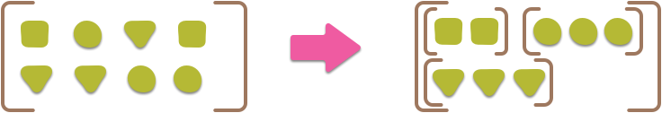
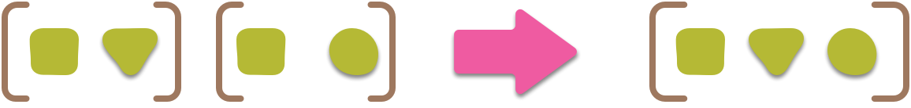

 

#### **Collect**
>	Collect methodu, Stream’de gerçekleştirilen ara işlemlerin sonucunu döndürmek için kullanılır.

 

#### **Concat**  

> 

>	İki veya daha fazla Stream’i birleştirip bir Stream yapmamıza olanak sağlamaktadır. Birleştirilecek Streamlerin aynı veri tipinde olması önemlidir.

 

#### **Difference**

> 

>	İki stream arasında farklı değerlere sahip olanları yani uniq olanları seçmemizi sağlar

 

#### **Distinct**

> 

>	Sql’de kullandığımız gibi, aynı elemanların tekrarlanmasını ortadan kaldırır, difference’dan farkı tek bir stream üzerinde distinct çalıştırılır ve aynı değerlerin stream’de bir defa yer alması sağlanır

 

#### **Drop**
>	Belirttiğimiz şarta uymayan değerleri siler ve Streami o şekilde dönderir

 

#### **Filter**

> 

>	Bağımsız değişken olarak iletilen Predicate’e göre öğeleri seçmek için kullanılır

 

#### **Flat-Map**

> 

>	Birden fazla kaynağı birleştirip yeni bir Stream oluşturmaya yarar

 

#### **Flatten**

> 

>	İç içe geçmiş koleksiyonları düzleştirmeye yani tek bir koleksiyona indexlememizi, atmamızı sağlıyor

 

#### **Fold**
>	Reduce için alternatif bir isimdir

 

#### **Group-By**

> 

>	Bize SQL dilindeki ‘GROUP BY’ yan tümcesine benzer işlevsellik sağlar bunları bazı özelliklere göre nesneleri gruplamak ve sonuçları bir Map örneğinde depolamak için kullanırız

 

#### **Inject**
>	Reduce için alternatif bir isimdir

 

#### **Intersection**

> 

>	İki listenin kesişimini almamızı sağlayan bir yapıdır, Stream API’nin direkt bunu destekleyen bir yapısı yoktur ama bu işlemi distinct ve filter kullanarak yapabiliriz

 

#### **Map**

> 

>	Stream’i başka bir stream’e çevirmek için kullanılır

 

#### **Mapcat**
>	Flat-map için alternatif bir isimdir

 

#### **Reduce**

> 

>	Genelde kümülatif operasyonlarda sıkça kullanılır. Bir veri setinde sırayla işlem yapmak istiyorsak ve bir önceki yaptığımız işlemi de dahil etmek istiyorsak reduce metodunu kullanabiliriz

 

#### **Reject**
>	Filtrenin tersi, şart ile eşleşmeyen öğeleri döndürür, bunu ise Predicate sınıfının not fonksiyonu ile sağlayabiliyoruz, not fonksiyonu içine şartımızı yazabiliriz

 

#### **Select**
>	Filter için alternatif bir isimdir

 

#### **Slice**

> 

>	Verilen ilk ve son konumlar arasında listenin bir alt dizisini döndürür

 

#### **Sort**

> 

>	Stream nesnesini sıralamak için kullanlır

 

#### **Take**
>	Listenin ilk n. İndexe kadar olan kısmını döndürür

 

#### **Union**

> 

>	İki streami birleştirir ve birleşim streaminde aynı elemnaların tekrarlanmasını ortadan kaldırır, yani concat ve distinct uygular
